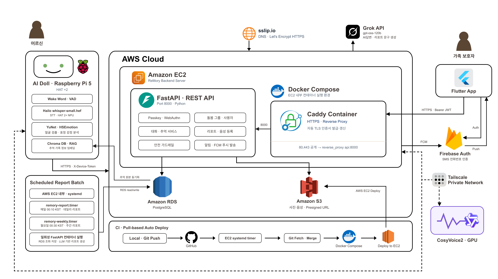

<div align="center">

# 🧸 ReMory Backend

**치매 어르신과 가족을 잇는 돌봄 인형 서비스, 리모리(ReMory)의 백엔드 서버**

인형 *모리* 는 어르신 곁에서 말벗이 되고,
가족은 앱으로 어르신의 하루를 지켜봅니다.

<br/>


-000000?logo=webauthn&logoColor=white)

</div>

---

## 📖 이런 서비스입니다

치매를 앓는 어르신은 하루 대부분을 혼자 보냅니다. 가족은 멀리 있고,
"오늘 어떠셨어요?" 를 물어볼 방법이 전화밖에 없습니다.

**리모리는 어르신 곁에 인형을 둡니다.** 인형 *모리* 는 어르신과 대화를 나누고,
가족이 남긴 메시지를 **가족의 목소리로** 읽어주고, 약 드실 시간을 알려줍니다.
그 사이에 쌓인 대화·감정·활동은 가족 앱의 홈 화면과 하루 리포트로 정리되어 전달됩니다.

<table>
<tr>
<td width="33%" valign="top">

### 👵 어르신
말벗이 되어주는 인형 **모리**.
"모리야" 하고 부르면 대답하고,
사진 속 추억을 함께 이야기하고,
약 시간을 챙겨줍니다.

</td>
<td width="33%" valign="top">

### 🧸 인형 (Device)
Raspberry Pi 5 + 카메라·마이크·스피커.
대화·감정·활동을 서버에 올리고,
가족 메시지와 어르신 정보(RAG)를
서버에서 받아 갑니다.

</td>
<td width="33%" valign="top">

### 👨‍👩‍👧 가족 (보호자)
Flutter 앱으로 어르신 상태를 보고,
대화방에 메시지·사진을 남기고,
자기 목소리를 등록하고,
데일리 리포트를 받습니다.

</td>
</tr>
</table>


---

## 🗺 시스템 구성

<div align="center">
  
</div>

<br/>

| | 무엇을 하나 | 핵심 |
|---|---|---|
| **① 엣지 · 인형 모리** | 어르신과 직접 대화 | Raspberry Pi 5 + HAT 2+ · 카메라/마이크/스피커/LCD<br/>웨이크워드 → STT → 얼굴·표정 감정 인식을 **기기 안에서** 처리 |
| **② AI 처리** | 이해하고 목소리를 만든다 | Gemini API(대화 생성) · CosyVoice2 자체 호스팅(TTS·가족 음성 클로닝) |
| **③ AWS 클라우드** | 📍 **이 저장소** | EC2 위의 FastAPI · 패스키 인증 · PostgreSQL · Vector DB(RAG) · S3 |
| **보호자 앱** | 가족이 보는 화면 | Flutter (iOS·Android) → HTTPS REST |

> 🔒 **얼굴 원본은 엣지에서 즉시 폐기하고 감정 라벨만 서버로 보냅니다.**
> 어르신 얼굴 이미지는 네트워크를 타지 않습니다.
>
> 🗑 **인형과 나눈 대화는 리포트 재료로만 7일 보관합니다.** 데일리 배치가
> 요약을 만든 뒤 지나간 발화를 지우고, 보호자 앱으로는 내보내지 않습니다.

**설계에서 신경 쓴 것**

- 🔐 **비밀번호가 없습니다.** 어르신 가족은 대체로 비밀번호 관리에 익숙하지 않습니다. 패스키(Face ID·지문)로 가입하고 로그인합니다.
- 🎭 **두 종류의 클라이언트, 두 종류의 인증.** 사람은 JWT, 인형은 기기 토큰(`X-Device-Token`)을 씁니다. 인형이 탈취돼도 가족 계정은 무사하고, 토큰은 언제든 재발급해 즉시 교체할 수 있습니다.
- 👨‍👩‍👧‍👦 **한 어르신, 여러 가족.** 딸도 아들도 같은 어르신에 연결됩니다. 초대 코드로 가족을 부르고, 주보호자가 구성원을 관리합니다.
- 🙈 **내 가족이 아니면 알려주지 않습니다.** 권한 없는 어르신·인형·약은 **404** 로 응답합니다.
- 🩹 **외부 서비스가 죽어도 서비스는 삽니다.** LLM 호출이 실패하면 규칙 기반 문구로, GPU 서버가 없으면 등록을 건너뛰고 상태만 남깁니다.

---

## 🧰 기술 스택

| 영역 | 사용 기술 | 메모 |
|---|---|---|
| **웹 프레임워크** | FastAPI + Uvicorn | 자동 생성되는 Swagger 문서(`/docs`) |
| **DB** | PostgreSQL (RDS) · SQLAlchemy 2.0 ORM | 로컬은 SQLite 로도 실행 가능 |
| **마이그레이션** | Alembic | 컨테이너 기동 시 `alembic upgrade head` 선행 |
| **인증** | WebAuthn 패스키 + JWT(access/refresh 로테이션) | 기기는 별도 `X-Device-Token` |
| **파일 저장** | S3 (비공개 버킷 + presigned URL) / 로컬 디스크 | `STORAGE_BACKEND` 로 교체 |
| **음성 합성** | CosyVoice2 (제로샷 화자 등록, RTX 2080ti) | Tailscale 사설망 경유 |
| **LLM** | Groq | 데일리 리포트 요약·제안 문구 |
| **문자 인증** | Firebase / mock | `SMS_PROVIDER` 로 교체 |
| **배포** | Docker Compose · Caddy · EC2 · systemd timer | HTTPS 자동, 자동 배포·리포트 배치 |
| **CI** | GitHub Actions (pytest on SQLite) | main push · 모든 PR |

---

## ✨ 주요 기능

| | |
|---|---|
| 🔐 **비밀번호 없는 가입·로그인** | 패스키(Face ID·지문) + 전화번호 인증. 비밀번호를 만들지도, 외우지도 않습니다 |
| 🏠 **홈 대시보드** | 연결 상태 · 대화 중 여부 · 배터리 · 현재 감정 · 감정 추이 · 활동 타임라인 · 안 읽은 알림을 한 화면에 보여줍니다 |
| 💬 **가족 대화방** | 가족이 남긴 글과 사진을 인형이 화면에 띄우고 음성으로 읽어줍니다 |
| 📷 **추억** | 사진 + 시기 + 이야기를 등록하면 인형이 RAG 컨텍스트로 받아가 어르신과 함께 회상합니다 |
| 🎙 **가족 목소리** | 녹음 한 번으로 제로샷 화자 등록. 인형이 딸의 목소리로 말합니다 |
| 🔔 **알림** | 부정 감정이 이어질 때, 연결이 끊겼다 돌아올 때, 새 메시지가 올 때 처럼 사건이 생기면 서버가 생성하고, FCM 으로 보호자 폰에 바로 띄웁니다 |
| 📊 **데일리 리포트** | 하루의 대화·감정·활동을 집계하고, 요약과 제안 문구는 LLM 이 씁니다. 그날 나눈 대화까지 재료로 넣어 씁니다 |
| 📈 **주간 리포트** | 한 주(월~일)의 데일리를 모아 대화·감정·긴급 알림 흐름을 정리합니다 |
| ⚙️ **인형 설정** | 이름 · 볼륨 · 기본 목소리 · 방해 금지 시간 · 약 복용 시간 등을 설정할 수 있습니다 |
| 👨‍👩‍👧‍👦 **가족 초대** | 초대 코드로 다른 가족을 부르고, 주보호자가 구성원을 관리합니다 |

---

## 🚀 빠른 시작

```bash
git clone https://github.com/Hanium-Remory/backend.git
cd backend

python3 -m venv .venv && source .venv/bin/activate
pip install -r requirements.txt

cp .env.example .env          # 개발은 기본값 그대로도 실행됩니다
alembic upgrade head          # 표 생성·변경은 여기서 합니다
uvicorn app.main:app --reload --port 8000
```

- 📘 **API 문서** — http://localhost:8000/docs (전체 엔드포인트와 스키마)
- 💚 **헬스체크** — `GET /health` (DB 까지 확인합니다)
- 📱 **인증번호** — mock 모드에서는 서버 로그에 찍힙니다
- 🌱 **샘플 데이터** — `POST /dev/seed` (`DEBUG=true` 일 때만)

> DB 없이 흐름만 보려면 `.env` 의 `DATABASE_URL` 을 `sqlite:///./dev.db` 로 바꾸면 됩니다.
> 설정값 전체와 설명은 [`.env.example`](.env.example) 에 있습니다.

**Docker**

```bash
docker compose up --build                                                      # 개발
docker compose -f docker-compose.prod.yml --env-file .env.prod up -d --build   # 운영
```

**테스트**

```bash
pytest        # SQLite + WebAuthn 목킹으로 전체 플로우 검증
```

---

## 📁 프로젝트 구조

```
app/
├── main.py        FastAPI 앱 + 라우터 등록 + 헬스체크
├── config.py      환경설정 (.env)
├── models.py      SQLAlchemy 모델
├── deps.py        인증 의존성 (보호자 JWT / 기기 토큰)
├── errors.py      공통 응답 봉투 + 예외 핸들러
├── routers/       인증 · 계정/가족 · 인형 · 홈/콘텐츠 · 기록
└── services/      권한검사 · SMS · 저장소(S3) · CosyVoice · LLM · 알림 생성

migrations/  Alembic 리비전      scripts/  리포트 배치 · 유지보수
deploy/      systemd 유닛        tests/    pytest
```

---

## 🚢 배포

EC2 한 대 위에서 Caddy 가 HTTPS 를 붙이고 뒤로 API 를 프록시합니다.
DB 는 RDS, 사진·음성 파일은 S3 비공개 버킷 + presigned URL 을 씁니다.
`deploy/` 의 systemd timer 가 자동 배포와 리포트 배치를 돌립니다 —
데일리는 매일 한국 시간 00:10, 주간은 월요일 00:30 에 지난주(월~일)를 만듭니다.
